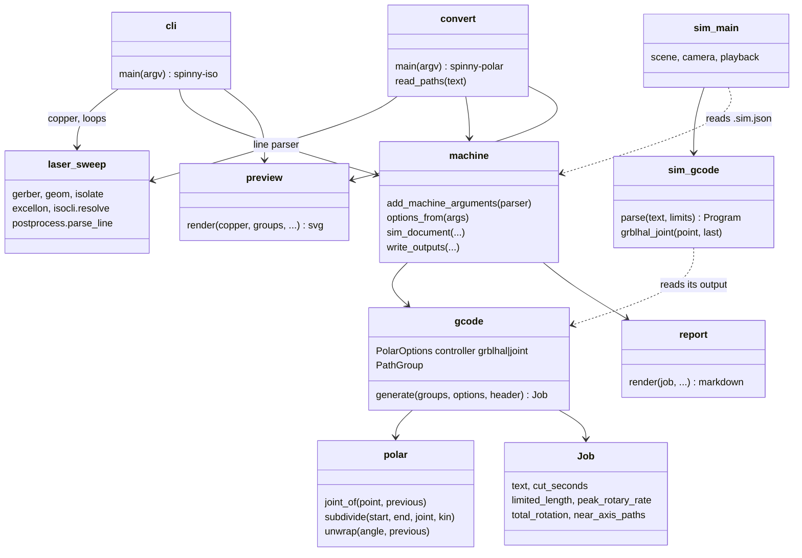

# spinny-laser

Isolation gcode for a two axis laser PCB machine: the laser rides a linear
`X` axis, the board sits on a rotary table (harmonic drive) turning about Z.
The rail passes over the rotation axis, so a board point is reached by its
polar radius on `X` and its polar angle on the table.

The controller is grblHAL with polar kinematics, which takes ordinary board
X/Y gcode and does the transform itself. This tool places the board on the
axis, pre-splits the toolpath where the controller's own segmentation would
stray, handles cuts through the axis, estimates the time with the table's
speed limit, and plays the job back in 3D. The copper reading and the
isolation loops come from the Cartesian tool in `../kicad-to-gcode`, pulled
in as a path dependency.

| Command | Job |
| --- | --- |
| `spinny-iso` | KiCad board or gerber to isolation gcode placed on the axis |
| `spinny-polar` | re-place and pre-split an existing X/Y laser job |
| `spinny-sim` | play a job back on a model of the machine |

## Usage

```sh
uv run spinny-iso board.kicad_pcb --spot 0.1 --power 500 --speed 400 --outline auto
uv run spinny-iso board-F_Cu.gbr --offset 0,14 --rotary-max-rate 1080
uv run spinny-polar ../kicad-to-gcode/out/sweep.gcode
cargo run --manifest-path sim/Cargo.toml -- out/board.gcode
```

Each command writes the job plus a markdown map, an SVG preview drawn around
the rotation axis, and a `.sim.json` sidecar the simulator draws the board
from. `--dry-run` prints the summary only.

## Placing the board

Board coordinates are what the controller turns into polar coordinates, so
where the board sits matters:

| Option | Effect |
| --- | --- |
| `--anchor center` | middle of the job on the axis (default) |
| `--anchor keep` | gerber origin on the axis |
| `--offset X,Y` | shift the placed board, to move copper off the axis |

The table has to turn fastest for cuts close to the axis. A path that passes
inside `--min-radius` (0.5 mm) is warned about; shift the board so nothing
does. The preview marks the axis, that radius, and the rail.

## Machine setup (grblHAL polar mode)

grblHAL is built with `POLAR_ROBOT` on. The X motor is the radius and the Y
motor is the table angle, in degrees:

| Setting | Value |
| --- | --- |
| `$101` | steps per degree: `200 * 16 * 100 / 360 = 888.889` for a 200 step motor at 16 microsteps through 100:1 |
| `$111` | table speed, deg/min: `300 rpm / 100 * 360 = 1080` for a motor good for 300 rpm |
| `$3` | direction invert mask, if the table turns the wrong way |
| `$32` | 1, laser mode |
| `$20` | 0, soft limits off; the angle keeps counting |

The controller transforms around machine `X = 0`, so the beam must be over
the rotation axis when the controller is powered or reset, and the X work
offset must stay zero. Polar mode has no homing.

Pass `$111` as `--rotary-max-rate`: the estimate then slows down where the
table cannot keep up and the summary says how much of the cut that is. Under
`M4` the controller scales power with actual speed, so the dose per mm
holds; the job just takes longer. At 1080 deg/min a 400 mm/min surface speed
is only reached beyond 21 mm from the axis.

## What the file contains

Board X/Y in `G94`, `F` on the first move of each path as the surface speed.
The controller splits cuts into 0.5 mm pieces and runs each as a joint move,
which is off by about `L^2 / 8R`: 30 microns at 1 mm radius. Segments are
pre-split here so every piece stays within `--tolerance` (0.005 mm). A cut
through the axis is cut to the center, closed, hopped two coordinate quanta
out along the new direction with the beam off, and reopened, because the
controller cannot turn on the spot and would spiral out of the center.

`--controller joint` writes the older form instead: the radius on `X`, the
angle on `--rotary-axis` in degrees, and every segment with its own feed
word (`--feed-mode inverse` for `G93`, `scaled` for `G94`). That is for a
controller without kinematics that is given the joint moves directly.

## Simulator

```sh
cd sim && cargo run -- ../out/board.gcode
```

The `.sim.json` next to the file supplies the board, controller, limits and
axis conventions; flags override them (`--help`). For a grblHAL file the
simulator reproduces the controller's 0.5 mm segmentation, feed scaling and
single-move rapids, so what it plays is what the machine does. Mouse drag
orbits, the wheel zooms. Space plays, up/down change speed, left/right step
one move, home/end jump, `g` toggles the ghost toolpath. The HUD shows the
line, radius and angle, board position, commanded and effective power, and
whether an axis limit is holding the move. `--screenshot out.png --at 60`
renders one frame at a job time and exits.

## Architecture



## Development

```sh
uv run pytest
cd sim && cargo test
```
