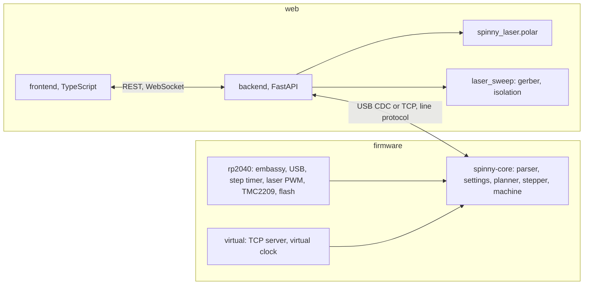
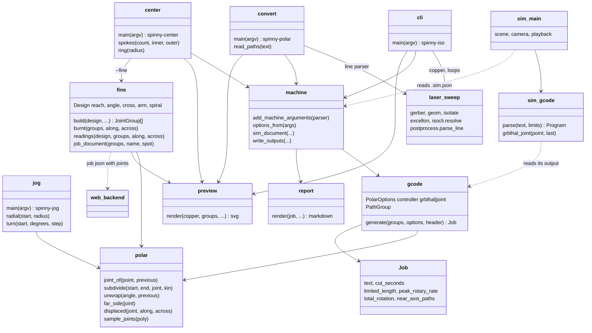

# spinny-laser

Isolation gcode for a two axis laser PCB machine: the laser rides a linear
`X` axis, the board sits on a rotary table (harmonic drive) turning about Z.
The rail passes over the rotation axis, so a board point is reached by its
polar radius on `X` and its polar angle on the table.

The machine runs its own firmware on a BTT SKR Pico and is driven from a
browser; see [Controller and web interface](#controller-and-web-interface).
The commands below are the gcode toolchain for a grblHAL controller with
polar kinematics, which takes board X/Y gcode and does the transform
itself; their output is also what the web interface imports. They place the
board on the axis, pre-split the toolpath where a controller's own
segmentation would stray, handle cuts through the axis, estimate the time
with the table's speed limit, and play the job back in 3D. The copper
reading and the isolation loops come from the Cartesian tool in
`../kicad-to-gcode`, pulled in as a path dependency.

| Command | Job |
| --- | --- |
| `spinny-iso` | KiCad board or gerber to isolation gcode placed on the axis |
| `spinny-polar` | re-place and pre-split an existing X/Y laser job |
| `spinny-jog` | MDI rapids for setup: move radially or turn the table |
| `spinny-center` | a burn that shows where the rotation axis really is; `--fine` amplifies what is left |
| `spinny-sim` | play a job back on a model of the machine |

## Usage

```sh
uv run spinny-iso board.kicad_pcb --spot 0.1 --power 500 --speed 400 --outline auto
uv run spinny-iso board-F_Cu.gbr --offset 0,14 --rotary-max-rate 1080
uv run spinny-polar ../kicad-to-gcode/out/sweep.gcode
cargo run --manifest-path sim/Cargo.toml -- out/board.gcode
```

Each command writes the job plus a markdown map, an SVG preview drawn around
the rotation axis, and a `.sim.json` sidecar the simulator draws the board
from. `--dry-run` prints the summary only.

## Finding the axis

Two things can be out, and neither shows up in a cut until it is drawn.
The radius zero may sit short of or past the axis, and the rail may pass
to one side of it, which no radius offset can correct: that is what the
cross slide is for. `spinny-center` burns a pattern that separates them.

```sh
uv run spinny-center --rotary-max-rate 400
```

The web page builds the same pattern as a job, options included, from
*Centering test* in the Jobs panel, pacing it at the table rate it read.

A radial cut holds the table still and runs the head along the rail, so
what it burns is the rail itself: a straight line lying the rail's own
miss distance from the axis. Four of them a quarter turn apart land on the
four sides of a square centered on the axis, and that square's side is
twice the miss distance. A full turn with the head still burns a ring
centered on the axis exactly, however far out everything else is, which is
the reference the rest is measured from.

So on the coupon:

| What you see | What it means |
| --- | --- |
| the ring's center | the rotation axis |
| the ring's diameter, against the one asked for | twice the radius zero error, with its sign |
| the square the lines bound | side is twice the cross slide error |
| the gap between opposing lines, once the square has closed | twice the radius zero error |

The line ends carry the same reading and are on the coupon even when the
ring is not: they lie on a circle at the reach plus the radius zero error,
so the longest distance across the pattern from one end to another is
twice that. Longer than twice the reach means the head at radius zero
sits outside the axis, shorter means short of it.

The ring carries the sign the lines cannot. It is burnt at a known
radius, so half its measured diameter less that radius is how far past
the axis the head sits at radius zero: wider than asked for means the head
is short of the axis there, narrower means it is past it. It is also the
scale check, being the one feature whose size is known in advance.

Halve the square's side and take it out on the cross slide, then re-burn.
When the lines meet at a point the rail is over the axis; move the head
half of whatever gap is left and set the radius zero there.

Cut it in constant power mode. The inner end of each line is what gets
measured, and under dynamic power the beam fades exactly where a move
begins.

### Amplifying what is left

Once the square has closed, what remains is under the width of a burnt
line, and no pattern burnt from one side of the axis can show more than
that: every mark is displaced by the same two errors, turned to the table
angle. Burnt from the far side, with the head run past the axis and the
table half a turn on, the same board point is displaced the other way.
`--fine` uses that. It crosses marks burnt from the two sides at a shallow
angle, and a crossing moves by 2 / tan(angle) times the error: 38 times at
the default 3 degrees.

```sh
uv run spinny-center --fine --rotary-max-rate 400
uv run spinny-center --fine --show-error 0.02,0.01   # the coupon a machine that is out would burn
```

The head runs to R -7 for it, so the job is written for the web interface
(`out/center-fine.json`) rather than as gcode. Import it and run it in
`mode const`.

| What you see | What it means |
| --- | --- |
| the rail line burnt with the table at 0, crossing the two arms | the crossings sit 8 mm apart when the rail passes over the axis; each 0.01 mm it misses by moves them 0.76 mm apart or together |
| the two spirals, crossing the rail line burnt with the table at 90 | they cross on that line when the radius zero is right; each 0.01 mm of error moves the crossing 0.38 mm along them, toward the short spiral's inner end when the head sits past the axis |

The map written next to the job turns each distance into a correction.
Two lines meeting at 3 degrees merge for about 2 mm either side of their
crossing: read the middle of the merged stretch, not its ends.

## Placing the board

Board coordinates are what the controller turns into polar coordinates, so
where the board sits matters:

| Option | Effect |
| --- | --- |
| `--anchor center` | middle of the job on the axis (default) |
| `--anchor keep` | gerber origin on the axis |
| `--offset X,Y` | shift the placed board, to move copper off the axis |

The table has to turn fastest for cuts close to the axis. A path that passes
inside `--min-radius` (0.5 mm) is warned about; shift the board so nothing
does. The preview marks the axis, that radius, and the rail.

## Controller and web interface

`firmware/` is the SKR Pico firmware and `web/` the browser interface. The
firmware is a joint-space controller: it moves the radius (`R`, mm) and the
table angle (`A`, degrees) as straight lines with a lookahead planner and
ties the laser power to the speed it reaches. Board geometry never reaches
it; the backend turns gerber, KiCad, SVG and gcode jobs into short joint
moves with the same kinematics module the commands above use, so board
jogs, independent radius and turn jogs, and whole jobs all arrive as the
same few line commands.

| Part | What | Build, test, run |
| --- | --- | --- |
| `firmware/core` | portable control core: parser, settings, planner, stepper, machine | `cd firmware && cargo test` |
| `firmware/rp2040` | the SKR Pico firmware | `cd firmware/rp2040 && cargo build --release && elf2uf2-rs target/thumbv6m-none-eabi/release/spinny-fw spinny-fw.uf2` |
| `firmware/virtual` | the core on a TCP socket with a virtual clock | `cd firmware && cargo run -p spinny-virtual -- --listen 127.0.0.1:2323` |
| `web/backend` | serial link, job import, streaming, API, serves the page | `cd web/backend && uv sync && uv run spinny-web` |
| `web/frontend` | the page | `cd web/frontend && bun install && bun run build` |

The line protocol is `docs/PROTOCOL.md`, the web API `docs/WEB_API.md`.
Open `http://localhost:8000`, connect to the board (or to
`socket://127.0.0.1:2323` for the virtual firmware), jog the beam over the
axis with the radius buttons, press "Set R=0 here", then turn the table
with the turn buttons: a positive turn must swing the point under the beam
counterclockwise seen from above, otherwise set `$dir_invert`. Check steps
per unit at low speed before the first job.



## Machine setup (grblHAL polar mode)

This section is for running the gcode toolchain against grblHAL instead of
the firmware above.

grblHAL is built with `POLAR_ROBOT` on. The X motor is the radius and the Y
motor is the table angle, in degrees:

| Setting | Value |
| --- | --- |
| `$101` | steps per degree: `200 * 16 * 100 / 360 = 888.889` for a 200 step motor at 16 microsteps through 100:1 |
| `$111` | table speed, deg/min: `300 rpm / 100 * 360 = 1080` for a motor good for 300 rpm |
| `$3` | direction invert mask, if the table turns the wrong way |
| `$32` | 1, laser mode |
| `$20` | 0, soft limits off; the angle keeps counting |

The controller transforms around machine `X = 0`, so the beam must be over
the rotation axis when the controller is powered or reset, and the X work
offset must stay zero. Polar mode has no homing.

Jog buttons send board X/Y, so a jog through the center sends the radius
motor back out with a half turn of the table, and from the center every
direction is "out". For setup, `spinny-jog` prints rapids that move one
thing at a time from the position the DRO shows:

```sh
uv run spinny-jog radius 10 --angle 0          # from the axis, out along the rail
uv run spinny-jog --from 10,0 turn 90          # table a quarter turn, head still
uv run spinny-jog --from 0,10 center           # back over the axis
```

Turns come out in steps of at most a quarter turn so the controller's
nearest-angle rule cannot send the table the other way. Seen from above the
point under the beam must swing clockwise on a positive turn; if not, flip
the Y bit in `$3` or the board comes out mirrored.

Pass `$111` as `--rotary-max-rate`: the estimate then slows down where the
table cannot keep up and the summary says how much of the cut that is. Under
`M4` the controller scales power with actual speed, so the dose per mm
holds; the job just takes longer. At 1080 deg/min a 400 mm/min surface speed
is only reached beyond 21 mm from the axis.

## What the file contains

Board X/Y in `G94`, `F` on the first move of each path as the surface speed.
The controller splits cuts into 0.5 mm pieces and runs each as a joint move,
which is off by about `L^2 / 8R`: 30 microns at 1 mm radius. Segments are
pre-split here so every piece stays within `--tolerance` (0.005 mm). A cut
through the axis is cut to the center, closed, hopped two coordinate quanta
out along the new direction with the beam off, and reopened, because the
controller cannot turn on the spot and would spiral out of the center.

`--controller joint` writes the older form instead: the radius on `X`, the
angle on `--rotary-axis` in degrees, and every segment with its own feed
word (`--feed-mode inverse` for `G93`, `scaled` for `G94`). That is for a
controller without kinematics that is given the joint moves directly.

## Simulator

```sh
cd sim && cargo run -- ../out/board.gcode
```

The `.sim.json` next to the file supplies the board, controller, limits and
axis conventions; flags override them (`--help`). For a grblHAL file the
simulator reproduces the controller's 0.5 mm segmentation, feed scaling and
single-move rapids, so what it plays is what the machine does. Mouse drag
orbits, the wheel zooms. Space plays, up/down change speed, left/right step
one move, home/end jump, `g` toggles the ghost toolpath. The HUD shows the
line, radius and angle, board position, commanded and effective power, and
whether an axis limit is holding the move. `--screenshot out.png --at 60`
renders one frame at a job time and exits.

## Architecture



## Development

```sh
uv run pytest
cd sim && cargo test
```
