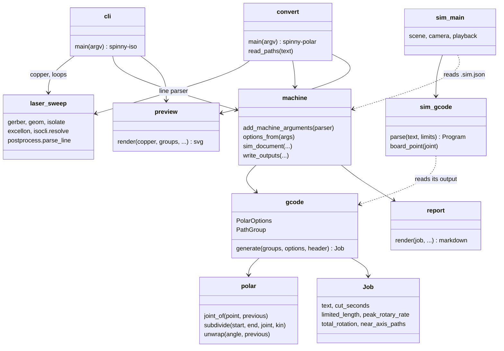

# spinny-laser

Isolation gcode for a two axis laser PCB machine: the laser rides a linear
`X` axis, the board sits on a rotary table (harmonic drive) turning about Z.
The rail passes over the rotation axis, so a board point is reached by its
polar radius on `X` and its polar angle on the table.

The copper reading and the isolation loops come from the Cartesian tool in
`../kicad-to-gcode`, pulled in as a path dependency. This project adds the
polar kinematics, an emitter for them, and a 3D playback simulator.

| Command | Job |
| --- | --- |
| `spinny-iso` | KiCad board or gerber to polar isolation gcode |
| `spinny-polar` | rewrite an existing X/Y laser job for the table |
| `spinny-sim` | play a polar job back on a model of the machine |

## Usage

```sh
uv run spinny-iso board.kicad_pcb --spot 0.1 --power 500 --speed 400 --outline auto
uv run spinny-iso board-F_Cu.gbr --offset 0,14 --rotary-max-rate 1080
uv run spinny-polar ../kicad-to-gcode/out/sweep.gcode
cargo run --manifest-path sim/Cargo.toml -- out/board.gcode
```

Each command writes the job plus a markdown map, an SVG preview drawn around
the rotation axis, and a `.sim.json` sidecar the simulator draws the board
from. `--dry-run` prints the summary only.

## Placing the board

Board coordinates are polar coordinates, so where the board sits matters:

| Option | Effect |
| --- | --- |
| `--anchor center` | middle of the job on the axis (default) |
| `--anchor keep` | gerber origin on the axis |
| `--offset X,Y` | shift the placed board, to move copper off the axis |

The table has to turn fastest for cuts close to the axis. A path that passes
inside `--min-radius` (0.5 mm) is warned about; shift the board so nothing
does. The preview marks the axis, that radius, and the rail.

## Machine setup

Set the `X` work zero with the beam over the rotation axis, or pass
`--axis-x` with the machine reading there. With the default sign, `A` equals
the board's polar angle, which means the table must turn clockwise seen from
above as `A` increases. If it turns the other way, flip the direction pin in
the controller config or pass `--invert-rotary`.

The rotary axis is configured in FluidNC like a linear one whose "mm" are
degrees. For a 200 step motor at 16 microsteps through a 100:1 drive:

```yaml
a:
  steps_per_mm: 888.889        # 200 * 16 * 100 / 360 steps per degree
  max_rate_mm_per_min: 1080    # 300 motor rpm / 100 * 360, deg/min
  acceleration_mm_per_sec2: 500
  max_travel_mm: 100000        # angles keep counting, do not soft limit them
```

Pass the same `max_rate` as `--rotary-max-rate`: the estimate then slows down
where the table cannot keep up and the summary says how much of the cut that
is. Under `M4` the controller scales power with actual speed, so the dose per
mm holds; the job just takes longer. At 1080 deg/min a 400 mm/min surface
speed is only reached beyond 21 mm from the axis.

## Feed words

Every cut segment carries its own `F`. The default is `G93` inverse time,
which tells the controller how long the segment takes rather than how far
it goes, so the surface speed is right however the controller sums a
linear and a rotary axis. `--feed-mode scaled` stays in `G94` and scales `F`
per segment instead, for controllers without `G93`.

Straight lines are spirals in joint space, so segments are split until the
joint-space path stays within `--tolerance` (0.005 mm) of the line. A cut
that only turns the table, which happens only on the axis, is crossed with
the beam off.

## Simulator

```sh
cd sim && cargo run -- ../out/board.gcode
```

The `.sim.json` next to the file supplies the board, axis letter, direction
and limits; flags override them (`--help`). Mouse drag orbits, the wheel
zooms. Space plays, up/down change speed, left/right step one move, home/end
jump, `g` toggles the ghost toolpath. The HUD shows the line, joint
position, board position, commanded and effective power, and whether an
axis limit is holding the move. `--screenshot out.png --at 60` renders one
frame at a job time and exits.

## Architecture



## Development

```sh
uv run pytest
cd sim && cargo test
```
