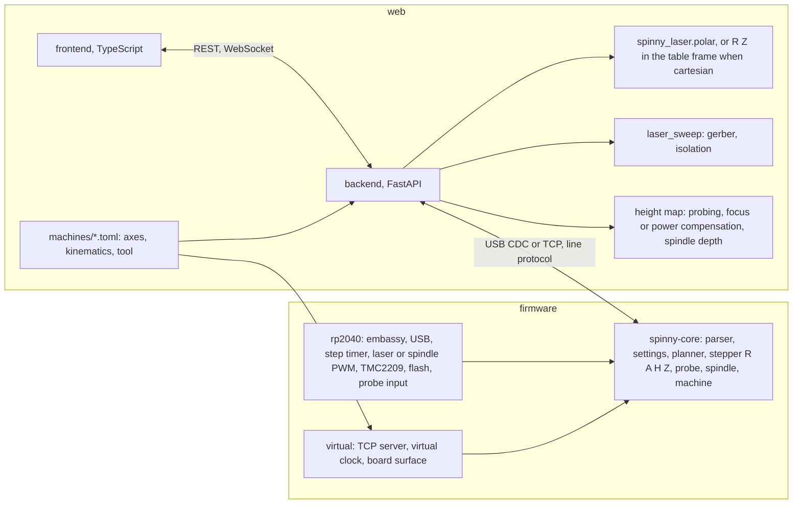

# Architecture

The machine is a joint-space controller on a BTT SKR Pico and a host
that does everything else. The firmware moves the radius (`R`, mm) and
the table angle (`A`, degrees), with the optional focus axis `H` and
cross slide `Z`, as straight lines with a lookahead planner, and ties the
laser power to the speed it reaches. Board geometry never reaches it: the
backend turns gerber, KiCad, SVG and gcode jobs into short joint moves
with the toolpath library's kinematics, so board jogs, independent radius
and turn jogs, and whole jobs all arrive as the same few line commands.

| Part | What | Build, test, run |
| --- | --- | --- |
| `firmware/core` | portable control core: parser, settings, planner, stepper, machine | `cd firmware && cargo test` |
| `firmware/rp2040` | the SKR Pico firmware | `mise run flash` |
| `firmware/virtual` | the core on a TCP socket with a virtual clock | `mise run virtual` |
| `web/backend` | serial link, job import, streaming, probing, API, serves the page | `uv run spinny-web` |
| `web/frontend` | the page | `cd web/frontend && bun run build` |
| `toolpath` | `spinny_laser`: polar kinematics, copper clearing and deposition, centering patterns, machine configs, gcode tools | `uv run pytest toolpath/tests` |
| `machines` | machine configurations in TOML, one per axis setup | `docs/MACHINES.md` |
| `sim` | plays gcode back on a model of the machine | `cd sim && cargo run -- ../var/out/board.gcode` |

The line protocol is [PROTOCOL.md](PROTOCOL.md), the web API
[WEB_API.md](WEB_API.md), the machine configuration files
[MACHINES.md](MACHINES.md).

Each part keeps its own module diagram next to its code:
[firmware/README.md](../firmware/README.md),
[web/backend/README.md](../web/backend/README.md),
[web/frontend/README.md](../web/frontend/README.md),
[toolpath/README.md](../toolpath/README.md).

## Runtime files

Everything the programs write at run time sits under `var/` at the
repository root, which is not tracked: the backend's `jobs/`,
`config.json` and `heightmap.json` (`spinny-web --data DIR` moves them),
and the command line tools' `out/`.
