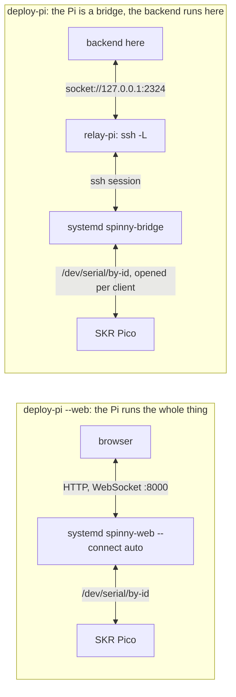

# Architecture

The machine is a joint-space controller on a BTT SKR Pico and a host
that does everything else. The firmware moves the radius (`R`, mm) and
the table angle (`A`, degrees), with the optional focus axis `H` and
cross slide `Z`, as straight lines with a lookahead planner, and ties the
laser power to the speed it reaches. Board geometry never reaches it: the
backend turns gerber, KiCad, SVG and gcode jobs into short joint moves
with the toolpath library's kinematics, so board jogs, independent radius
and turn jogs, and whole jobs all arrive as the same few line commands.
With a paste dispenser the table's driver turns the plunger instead, as
`A` in mm, and a job is dots on the pads; a camera on the head is read
through the sibling pcb-vision repository's `pcbv serve`, which finds the
board in its picture, for measuring the camera's offset from the tool and
lining a job up with the board.

| Part | What | Build, test, run |
| --- | --- | --- |
| `firmware/core` | portable control core: parser, settings, planner, stepper, machine | `cd firmware && cargo test` |
| `firmware/rp2040` | the SKR Pico firmware | `mise run flash` |
| `firmware/virtual` | the core on a TCP socket with a virtual clock | `mise run virtual` |
| `web/backend` | serial link, job import, streaming, probing (grid or pads), dispensing, the camera through pcbv, alignment, API, serves the page | `uv run spinny-web` |
| `web/frontend` | the page | `cd web/frontend && bun run build` |
| `toolpath` | `spinny_laser`: polar kinematics, copper clearing and deposition, centering patterns, pads and holes of a layer, the alignment fit, machine configs, gcode tools | `uv run pytest toolpath/tests` |
| `machines` | machine configurations in TOML, one per axis setup, with the pins and the page's controls; edited on the page's Config tab | `docs/MACHINES.md` |
| `cam` | CAM profiles in TOML: axes, tools with their cutting settings, operations, the gcode post | `docs/CAM.md`, `uv run spinny-cam` |
| `sim` | plays gcode back on a model of the machine | `cd sim && cargo run -- ../var/out/board.gcode` |
| `../pcb-vision` | `pcbv`: the camera's capture and the localizer that finds a KiCad board in its picture, served to the backend over JSON lines | `mise run build-pcbv`; its own `mise run test` |

The line protocol is [PROTOCOL.md](PROTOCOL.md), the web API
[WEB_API.md](WEB_API.md), the machine configuration files
[MACHINES.md](MACHINES.md), the CAM profiles [CAM.md](CAM.md).

```mermaid
flowchart LR
    subgraph web
        FE[frontend, TypeScript] <-->|REST, WebSocket| BE[backend, FastAPI]
        BE --> KIN[spinny_laser.polar, or R Z in the table frame when cartesian]
        BE --> LS[laser_sweep: gerber, isolation]
        BE --> HM[height map: probing a grid or the pads, focus or power compensation, spindle depth, a dispenser's gap]
        BE --> CAM[spinny_laser.cam, camjob, post: a design through a profile's operations, gcode for another controller]
        BE --> AL[alignment: marks from the tool or the camera, a turn and a shift fitted and applied to the job]
        BE <-->|JSON lines over stdio or TCP| PV[pcb-vision pcbv serve: capture, board localizer, frame, spot]
        PV --> VID[/dev/videoN on the head]
        MF[machines/*.toml: axes, pins, kinematics, tool, camera, the page's controls] <--> BE
        CF[cam/*.toml: axes, tools, operations, post] --> CAM
        CF --> CLI[spinny-cam]
    end
    MF --> VIRT
    BE <-->|USB CDC or TCP, line protocol| CORE
    subgraph firmware
        RP[rp2040: embassy, USB, step timer, laser or spindle PWM, tool output, probe and endstop inputs on settable pins, TMC2209, flash] --> CORE[spinny-core: parser, settings, planner, stepper R A H Z, probe, homing and endstop limits, spindle, a dispenser's plunger on A, tool output, machine]
        VIRT[virtual: TCP server, virtual clock, board surface, endstops] --> CORE
    end
```

Each part keeps its own module diagram next to its code:
[firmware/README.md](../firmware/README.md),
[web/backend/README.md](../web/backend/README.md),
[web/frontend/README.md](../web/frontend/README.md),
[toolpath/README.md](../toolpath/README.md).

## Controller on a Raspberry Pi

Two ways, one controller. Only one of them may hold the controller's port
at a time; installing either service stops the other.

**The Pi is a bridge.** `mise run deploy-pi -- user@host` copies the
repository and its sibling `kicad-to-gcode` to the Pi, where uv installs
Python 3.12 and the dependencies, and a systemd unit runs `spinny-bridge`
(`web/backend/src/spinny_web/bridge.py`): the controller's port served on
the Pi's loopback port 2324, one client at a time, the device looked up
under its by-id name and opened when a client connects and closed when it
leaves, so the firmware greets every connect with its banner and stops
everything when the client goes. `mise run relay-pi -- user@host`
forwards that port here over ssh and the page connects to
`socket://127.0.0.1:2324`; the run lives in the backend here, so it ends
if this machine does. The bridge writes the device only when it is ready,
gives up a device that takes nothing for 3 s and a client that stops
reading, tells the client why in a `[MSG:bridge ...]` line that the
backend logs and names in a failed connect, and lets a new client take
over from one that has gone quiet, so a board that wedges needs nothing on
the Pi restarted. With no bridge installed, `relay-pi` starts socat on the
Pi for the session instead; socat blocks in a write to a board that stops
taking bytes and serves no one after that until the relay is started
again, which is why the bridge exists.

**The Pi runs the whole thing.** `mise run deploy-pi -- --web user@host`
builds the page here and copies it along, and the unit runs the backend
with `--connect auto`: it keeps its own link to the controller up, so a job
uploaded to `http://host.local:8000` streams from the Pi whether or not
the page stays open, and a controller that is replugged, or goes quiet and
is given up, is taken up again by itself. The Pi needs no bun or Rust, and
`firmware/` and `sim/` stay behind. Jobs, the height map and the resume
record are the Pi's own. A camera on the head is read where the backend
runs: on a Pi running the whole thing `pcbv` has to be built for it
(`cargo build --release -p pcbv` in a pcb-vision checkout on the Pi, the
binary named in the machine file's `[camera] pcbv`); with the Pi as a
bridge, `pcbv serve --listen` on the Pi and a `socket://pi:2325` device
here reach its camera over the network.

Either way, `mise run usb-log -- user@host` (or with no host, here)
follows the kernel's USB and serial lines, which settle whether the board
dropped off the bus or re-enumerated, and `mise run pi-logs -- user@host`
shows the bridge's journal, or on a Pi running the backend its journal
and the tails of `spinny.log` and `wire.log`. `docs/OPERATING.md` has the
procedure for a machine that went quiet.

```mermaid
flowchart LR
    subgraph DEPLOYED[deploy-pi --web: the Pi runs the whole thing]
        BR[browser] <-->|HTTP, WebSocket :8000| BE1
        BE1[systemd spinny-web --connect auto] <-->|/dev/serial/by-id| BOARD1[SKR Pico]
    end
    subgraph BRIDGED[deploy-pi: the Pi is a bridge, the backend runs here]
        BE2[backend here] <-->|socket://127.0.0.1:2324| SSH[relay-pi: ssh -L]
        SSH <-->|ssh session| BRG[systemd spinny-bridge]
        BRG <-->|/dev/serial/by-id, opened per client| BOARD2[SKR Pico]
    end
```

## Runtime files

Everything the programs write at run time sits under `var/` at the
repository root, which is not tracked: the backend's `jobs/`,
`config.json`, `heightmap.json`, `resume.json` (how far the last run got
and the plan it was made from, written as the run goes), `position.json`
(where the machine last said it was, for *Last known*), `spinny.log`
(the backend's log, rotated at 1 MB) and `wire.log` (every line over the
link with its time, rotated at 8 MB; `spinny-web --data DIR` moves them
all), and the command line tools' `out/`.
