# Web interface API

The backend (`web/backend`, Python) owns the serial link to the firmware and
serves the frontend (`web/frontend`, TypeScript) as static files. The
frontend only talks to the backend; it never sees the serial port.

Base URL: `http://<host>:8000`. Bodies and responses are JSON unless noted.

## Connection

| Method and path | Body | Returns |
| --- | --- | --- |
| `GET /api/ports` | | `{"ports": [{"url": "/dev/ttyACM0", "description": "..."}]}` plus any `socket://` url last used |
| `POST /api/connect` | `{"url": "/dev/ttyACM0"}` | state snapshot; `socket://host:port` reaches the virtual firmware; anything but a device path, a `COMn` port or a `socket://` url is refused with 400 |
| `POST /api/disconnect` | | state snapshot; a turning spindle or a lit beam is stopped first (`laser off` on an idle machine; one that is moving or held, or does not take `laser off` at once, is held and then reset once at rest, as a run's stop does), since the firmware does not see a port close; the backend's shutdown does the same |
| `GET /api/state` | | state snapshot |

State snapshot:

```json
{
  "connected": true,
  "url": "/dev/ttyACM0",  // the last url used; kept after a disconnect, null before the first connect
  "firmware": {"version": "0.1.0", "lines": 16, "blocks": 32},
  "machine": {
    "state": "Idle", "alarm": null,
    "joint": {"r": 12.345, "a": 90.1234, "z": 0.0, "h": -1.25},
    "probe": false,
    "board": {"x": 0.0, "y": 12.345},
    "rate": 0.0, "laser": 0, "mode": "dyn", "enabled": true,
    "queue": {"planner": 32, "lines": 16}
  },
  "profile": {"kinematics": "polar", "tool": "laser", "h_axis": true, "r_max": 60.0, "z_max": 0.0},
  "run": null
}
```

`board` is derived on the host from `joint`: `x = r cos a`, `y = r sin a`
on the polar machine; on a cartesian one it is `(r, z)` turned by `a`.
`profile` is what the machine is, from its settings as last read (a laser
on the polar machine before the first): `kinematics` is `polar` or
`cartesian` (`$cartesian`), `tool` is `laser` or `spindle` (`$spindle`).
It follows a setting changed from the settings page or typed at the
console.
`joint.h` (the focus axis, mm, up positive) and `probe` (the probe input is
active) are `null` on a machine without a focus axis (`$h_axis=0`).

## Moving

| Method and path | Body |
| --- | --- |
| `POST /api/jog` | `{"kind": "joint", "dr": 1.0, "da": 0.0, "dh": 0.0, "feed": null}` or `{"kind": "board", "dx": 0.0, "dy": -1.0, "feed": 500}` relative; `dh` is the focus axis, alone or with the joints (the firmware refuses it without one fitted); `{"kind": "joint", "dz": 0.5}` moves the cross slide, which on the polar machine cannot be combined with `dr`, `da` or `dh`, and on a cartesian one is a joint beside them |
| `POST /api/goto` | `{"kind": "joint", "r": 0, "a": 0, "h": 0}` or `{"kind": "board", "x": 3, "y": 4, "feed": 500}` absolute; an axis left out keeps the coordinate the head will have once the jog in progress ends, and is refused with 400 while that end is not known; `{"kind": "joint", "z": 0}` sends the cross slide there, again not with `r`, `a` or `h` on the polar machine. On a cartesian machine a board jog or goto is planned in the table's frame from a fresh status, and answers 409 while the table may still be turning under a move in progress |
| `POST /api/jog/cancel` | |
| `POST /api/position` | `{"r": 0}`, `{"a": 0}`, `{"h": 0}` and/or `{"z": 0}`: declare the current position |

A jog, a goto or a position declaration answers 409 while a run owns the
machine, from the moment the run is being planned, and while the board is
being probed. A board move whose
lines would pass the firmware's `r_max` is refused whole with 400 before
any of them goes out; a move within the limit chains from the end of the
jog in progress. Move requests are served one at a time.
| `POST /api/motors` | `{"enabled": false}`; turning them off answers 409 while a run or probing owns the machine: the drivers share one enable line, so `disable` (and `$idle_ms`) lets go of the focus axis too, and a head that is not self-locking sinks unseen |
| `POST /api/unlock` | |
| `POST /api/realtime` | `{"action": "hold" \| "resume" \| "reset" \| "cancel" \| "status"}`; while a job runs, `hold` and `resume` are the run's own, and `reset` ends the run before the byte goes out; while a run is still being prepared, `hold` and `reset` cancel its start (and still go out) |
| `POST /api/command` | `{"line": "cut R10 F300 S200"}` returns `{"lines": ["ok"]}`: what the command printed, then its answer; a line of `?`, `!` or `~` alone goes out as that realtime byte and returns `{"lines": []}`; status reports and `[MSG:...]` lines arrive as events, except that a bare `status` returns its report in `lines` (asked for with the `?` byte); a typed `laser off` or `spindle off` during a run stops the run (hold, then reset) and returns `{"lines": []}`, and while a run is still being prepared cancels its start and goes out as typed; `set`, `disable`, `$<name>=<value>`, `$load`, `$defaults` and `spindle S` answer 409 while a run or probing owns the machine (`spindle S` only while probing); an accepted `set`, or a `$` line that may rescale or turn the axes, takes the height map's focus offset back |

Board jogs and gotos are turned into joint moves on the host with the chord
tolerance from the settings page, so a board move through the axis becomes
a radial move in, a turn, and a radial move out. On a cartesian machine a
board move is one straight `jogto R Z`, with the board turned by the table
angle as reported, and `z_max` bounds it beside `r_max`. Joint jogs move one motor
at a time when only one delta is given: that is the independent axis
control.

## Laser

| Method and path | Body |
| --- | --- |
| `POST /api/laser` | `{"power": 50, "ms": 2000}` constant beam with a timeout; `ms` left out means the firmware's `laser_ms`, `ms` under 1 is 400, and over 60000 the firmware's refusal comes back as 400 |
| `POST /api/laser/off` | during a run this is the run's hold, since `laser off` on the wire would stall the cut and let it go on; `POST /api/mode` answers 409 while a run is active |
| `POST /api/mode` | `{"mode": "dyn" \| "const"}` |

On a spindle machine (`profile.tool` `spindle`) `POST /api/laser` answers
400, and the spindle has its own:

| Method and path | Body |
| --- | --- |
| `POST /api/spindle` | `{"power": 800}` starts it at that `S`, or changes its speed; 400 on a laser machine, 409 while a run is active (a run starts and stops it itself) and while the board is probed (the probe may be the tool) |
| `POST /api/spindle/off` | stops it; 409 while a run is active, where the stop is the run's stop |

## Settings

| Method and path | Body |
| --- | --- |
| `GET /api/settings` | returns `{"values": {"r_steps": 256, ...}, "schema": [{"name", "unit", "help"}], "host": {"tolerance": 0.005, "clearance": 2.0, "spinup": 2.0}}` |
| `PUT /api/settings` | `{"values": {"r_rate": 800}, "host": {"tolerance": 0.005, "clearance": 2.0, "spinup": 2.0}}`; all or nothing: an unknown name, a value that is not a finite number, a tolerance outside `(0, 10]` mm, a clearance outside `(0, 100]` mm or a spin-up outside `[0, 600]` s answers 400 with nothing applied, and a value past what any firmware setting holds (a whole number past 4294967295, any other past 1e7 in magnitude) or a line longer than the link takes is refused the same way; a value the firmware refuses has the ones sent before it put back, and one lost on the link unanswered is put back with them, since it may have been taken; the host settings are stored only once the values went through; `values` answers 409 while a run or probing owns the machine, and a run or probing asked for during the write waits for it |

`clearance` and `spinup` are for milling: the tool travels `clearance` mm
over the surface (H 0 without a height map, the map's highest point with
one), and a run dwells `spinup` seconds after starting the spindle or
changing its speed.
| `POST /api/settings/save` | writes the firmware settings to flash |

## Jobs

| Method and path | Body |
| --- | --- |
| `POST /api/jobs` | multipart: `file` plus optional fields `power`, `speed`, `spot`, `anchor` (`center`/`keep`), `offset_x`, `offset_y`, `passes` (1 to 50: isolation loops offset around the copper, not the group passes below), `clear` (`off`, `radial`, `rings` or `lines`: gerber and KiCad only, a `copper clearing` group of everything the isolation leaves inside the board outline, placed before the outline group; outline pieces whose ends meet within 0.001 mm are joined into one loop first, and with no closed outline, or one that holds less than half the copper (a lone cutout), the X/Y box the isolation spans is cleared instead); a file over 64 MB answers 413 |
| `POST /api/center` | the polar laser's only (400 on a cartesian or spindle machine); JSON, every field optional: `{"fine": false, "lines": 4, "reach": 6, "ring": 8, "angle": 3, "cross": 4, "arm": 2.5, "spiral": 5, "show_error": [0.02, 0.01], "power": 400, "speed": 200, "spot": 0.1}`, the options of `spinny-center` (a missing `reach` or `ring` takes the pattern's default, `lines` belongs to the coarse pattern, `angle`, `cross`, `arm`, `spiral` and `show_error` to the fine one); stores the pattern as a job with `source` `center` and answers `{"job": job, "summary": [lines], "notes": [how to read it]}`. The table rate paces the ring and spirals; a power over the last read `s_max` is refused |
| `GET /api/jobs` | `{"jobs": [summary]}`: the job without coordinates, each group's `paths` and `joints` being counts |
| `GET /api/jobs/{id}` | the job |
| `PATCH /api/jobs/{id}` | `{"name": "coupon", "groups": [{"index": 0, "label": "outline", "power": 500, "min_power": 100, "speed": 400, "passes": 2, "enabled": true, "depth": 1.6, "plunge": 30}], "offset": {"x": 0, "y": 14}}`; every field optional, a speed or plunge under 0.001 mm/min is refused like one of 0, a depth must be above 0 and at most 50 mm |
| `DELETE /api/jobs/{id}` | |
| `POST /api/jobs/{id}/run` | starts streaming; optional body `{"compensate": "off" \| "auto" \| "focus" \| "power"}` follows the height map (see below), `off` when left out; 409 while probing; 400 for a joint-space group on a cartesian or spindle machine, for a spindle without the focus axis (`$h_axis=0`), which is its depth axis, and for an enabled milling group with cuts at a spindle speed (`power`) of 0 or less |
| `POST /api/run/hold`, `/api/run/resume`, `/api/run/stop` | while a run is still being prepared (its checks and estimate), `hold` and `stop` cancel its start, and the pending `POST /api/jobs/{id}/run` answers 409 with the reason; `POST /api/laser/off` and a reset do the same, and a reset in that window is also seen by the preparation itself |
| `GET /api/run` | progress, or `null` before any job has run |

Every refusal is `{"detail": "<text>"}`; a body or field that does not
parse is 422 with `detail` as a list; a link fault (port gone, no answer)
is 502.

Accepted uploads: `.svg` (paths, lines, polylines, polygons, rects,
circles; curves flattened; mm from the viewBox), `.gcode`/`.nc` (absolute
X/Y `G0`/`G1` with `S` and `F`), `.json` (a job), `.gbr` (copper layer,
isolation loops through the sibling geometry engine), `.kicad_pcb`.

Job:

```json
{
  "id": "a1b2", "name": "board", "source": "gerber",
  "spot": 0.1, "offset": {"x": 0, "y": 14},
  "groups": [
    {"label": "isolation loop 1", "power": 500, "min_power": 0, "speed": 400, "passes": 1, "enabled": true,
     "depth": 0.1, "plunge": 60, "paths": [[[x, y], ...], ...]},
    {"label": "rail line through the axis", "power": 400, "min_power": 0, "speed": 200, "passes": 1, "enabled": true,
     "paths": [[[x, y], ...]], "joints": [[[r, a], ...]]}
  ],
  "outline": [[[x, y], ...]], "copper": [[[x, y], ...]],
  "stats": {"length_mm": 0, "seconds": 0, "max_radius": 0, "min_radius": 0,
            "limited_fraction": 0, "moves": 0}
}
```

Path coordinates are board mm with the rotation axis at the origin; the
offset is already applied. `min_power` is the group's floor in the
firmware's `dyn` mode, sent as `M` on each of its cuts when above 0 (a
floor above `power` goes out as `power`); a job without it loads with 0.
`passes` (1 to 100) is how many times the group streams: all of its
paths once, then all of them again from where the head stopped, so an
open path is gone back to and a closed loop starts where it ended; a job
without it loads with 1, and the stats count every pass. A group may instead carry `joints`: polylines
in joint space, radius mm and angle degrees, each pair of points streamed
as one `cut` with no kinematics in between, and a negative radius meaning
the far side of the axis. Such a group is written about the axis, so a
job holding one cannot be given an offset; its `paths` are only what the
preview draws, and the importer fills them in from the joints when they
are left out. Progress:

```json
{"job": "a1b2", "state": "running", "sent": 120, "acked": 118, "total": 900,
 "seconds": 12.5, "estimate": 95.0, "group": 0, "error": null}
```

On a spindle machine a job is milled: `power` is the spindle's `S`,
`speed` the feed, `depth` how far under the surface the group's last pass
cuts (each pass a step deeper: pass k of n at `depth * k / n`) and
`plunge` the rate the tool goes down into it. The run lifts the tool to
the travel height, starts the spindle and dwells for the spin-up, then
for every path goes to its start at the travel height, plunges, cuts at
depth (H on every cut) and rises back; the spindle changes speed between
groups that ask for another and stops at the end. Without a height map
the surface is H 0, so zero H with the tool touching the copper first.
A job without `depth` or `plunge` loads with 0.1 mm and 60 mm/min.

`group` is `null` until the first line has gone out. `state` is `running`, `hold`, `done`, `stopped`, or `error`; `error` carries
the reason when it is `error`, why a run was stopped from outside (a reset
from the console), and what a stop cost when it was not clean: the machine
did not come to rest in time and was reset moving, or is in an alarm the
operator has to clear. A stop that could not reach the machine ends the run
as `error`, since the machine is still cutting what it had. `done` means
every line was answered and the machine came to rest; a machine still busy
an hour after the last answer, holds not counted, ends the run as `error`
with a stop. `acked` counts lines the firmware answered; lines a stop
flushed are not answered.

## Height map

The touch probe on the focus axis measures the board over a grid, and a
run can follow the result. Heights are the focus axis position at
contact, mm, at grid points in board mm; `focus_offset` is focus height
minus contact height, which `focus` sets.

The heights are focus axis positions in the frame of the session that
probed them, and the focus axis has no home: it reads 0 wherever the head
was when the machine started. So `focus_set` is cleared, the heights kept,
whenever that frame may have changed: a `POST /api/position` (H renumbered,
or R, A or Z, which move the board under the map), a `PUT /api/settings`
that changes `r_steps`, `a_steps`, `z_steps`, `h_steps`, `dir_invert`,
`cartesian` or `h_axis`, a connect, a restart the link sees (a banner no
reset byte came before; a reset keeps the position), and a map put back
with `PUT /api/heightmap`. A `heightmap` event says so. A restart during
probing ends it with an error, and an offset set before a frame change is
never followed, even if a map written back over the change still says
`focus_set`.
`focus` with `{}` then ties the map to the new frame: the offset takes the
difference with it. An offset given as a number holds only for heights
probed in the frame in use, so it is refused (400) for any other map, and
probing again keeps the last offset only when that offset was not taken
across a frame change.

| Method and path | Body |
| --- | --- |
| `GET /api/heightmap` | returns `{"map": map or null, "probe": probing progress or null, "settings": probe settings}` |
| `POST /api/heightmap/probe` | `{"x0": -20, "y0": -15, "x1": 20, "y1": 15, "nx": 5, "ny": 4}`: probes that grid (2 to 50 points a side) and replaces the map; 409 without a focus axis, with the probe already touching, unless `Idle`, with a spindle turning, or while a run or another probing is under way (a run and probing asked for at once: one starts, the other is 409); a point the probe tip cannot reach, or one that would take the head past `r_max` (or `z_max` on a cartesian machine, where the rail and the cross slide put the tip over each point), is 409 before anything moves; the map is done once the head is back at the travel height and still |
| `POST /api/heightmap/stop` | holds and resets like a run's stop; a probing still starting (checking the machine) ends before anything moves, and so it does on `POST /api/realtime` `reset`; 409 when nothing is being probed |
| `POST /api/heightmap/focus` | `{"offset": 1.2}` sets the focus offset, for a map probed in the focus axis frame in use (400 otherwise); `{}` takes it from where the head is: the operator has focused the beam by eye over the probed area, and the offset is the head's height (`h`, or 0 without a focus axis) less the map's height under the beam; 400 with the beam more than 1 mm outside the grid, where the map would only guess |
| `PUT /api/heightmap/settings` | any of `{"depth": 5, "feed": 60, "slow": 15, "backoff": 0.3, "offset": [along, across], "rayleigh": 0.5}`, kept in the backend's config: the most the probe goes down from the travel height, the first and second touch speeds (mm/min, `slow` 0 for one touch), how far it backs off between them, the probe tip from the beam along the rail (outward positive) and across it (positive to the left of outward seen from above: board +Y at table angle 0, +Z on a cartesian machine), in mm, and the beam's Rayleigh length for power compensation (mm) |
| `PUT /api/heightmap` | a map, to put one back from a file; stored with `focus_set` false, whatever it says, until `focus` with `{}` |
| `DELETE /api/heightmap` | clears it |

Map:

```json
{"grid": {"x0": -20, "y0": -15, "x1": 20, "y1": 15, "nx": 5, "ny": 4},
 "heights": [[-1.512, -1.498, ...], ...],
 "focus_offset": 1.2, "focus_set": true,
 "probe_offset": [0, 0], "created": "2026-09-23T10:00:00+00:00"}
```

`heights[iy][ix]` is `null` where not yet probed. Probing progress:
`{"state": "running" | "done" | "stopped" | "error", "done": 3, "total":
20, "point": [ix, iy] or null, "seconds": 12.5, "error": null}`.

Probing starts from the head's height at the time, which is the travel
height between points: raise the head so the probe clears the board
first. At each point the tip goes over it, touches at `feed`, backs off
`backoff` and touches again at `slow`, and rises back. A tip off the rail
by `offset[1]` never comes nearer the axis than that; a grid point inside
that circle is probed from the nearest place on it when that is within
half a grid spacing, and refused otherwise. A miss leaves the firmware in
`Alarm:2` and the probing in `error`.

One point, as the lines go out (each answered before the next; the times
are for the default settings with the board 2 mm under the travel height).
A move is answered once it is queued, and a probe only once the motion
ahead of it has run as well, so each probe waits for the head to come to
rest first: its answer time is then its own descent at the lower of its
feed and `h_rate`, plus 10 s, however long the table takes to turn to the
point. A hold stretches every wait:

```mermaid
gantt
    title One probe point
    dateFormat X
    axisFormat %s s
    section Lines
    go R A (to the point, at travel height)   :0, 1
    probe H-5 F60 (first touch)               :1, 3
    go H (back off 0.3 mm)                    :3, 4
    probe H-0.6 F15 (second touch, recorded)  :4, 6
    go H (back to travel height)              :6, 7
```



With a spindle the probe may be the tool itself, touching grounded copper
(probe offset `[0, 0]`), and `focus` is the touch-off: jog the tool down
until it just touches the copper over the probed area, then `{}`. The map
plus the offset is then the surface under the tool, a cut goes to that
less its depth, and `power` compensation is refused. Probing is refused
while the spindle turns (the status's `L` is not the off duty), and the
spindle is not started while probing.

A compensated run is refused with 400 unless the map is complete, its
focus offset has been set, it spans at most 5 mm top to bottom, and it
covers every enabled group of the job to within 1 mm (a joint-space
group by points along its moves, which sweep arcs on the board, not by its
vertices alone). `focus` needs the
focus axis: each line carries the focus height (map plus offset) at its
end, and cuts are split to a quarter of the grid spacing, 0.25 to 2 mm.
`power` leaves the head where it is and raises each cut piece's `S` and
`M` by `sqrt(1 + (dz / rayleigh)^2)`, `dz` the defocus there, up to
`s_max`. `auto` is `focus` with a focus axis, else `power`.

A `POST` from a page on another origin is refused with 403, and so is a
websocket opened by one; only the server's own origin and any
`--cors-origin` pass. Requests without an `Origin` header (scripts, curl)
are not a page's and pass. `--allowed-host` restricts the `Host` header as
well.

## Events

`WS /ws` sends JSON events; the client sends nothing. The payload's fields
sit next to `type` in one flat object: `{"type": "console", "dir": "rx",
"text": "ok"}`. While the last `state` said connected, the page takes 5 s
with no event as a dead socket (a network gone quiet sends no close) and
reconnects; with no machine connected nothing is sent between changes, so
it does not watch then.

| `type` | Payload |
| --- | --- |
| `state` | the state snapshot, at 5 Hz idle and 10 Hz while moving |
| `console` | `{"dir": "rx" \| "tx", "text": "...", "poll": false}` every line either way; `poll` marks the status poll the backend sends several times a second and the report it brings back, which a console should hide by default or it buries everything else |
| `progress` | the progress object |
| `heightmap` | what `GET /api/heightmap` returns, whenever the map, the probing or the probe settings change |
| `message` | `{"level": "info" \| "error", "text": "..."}` |
