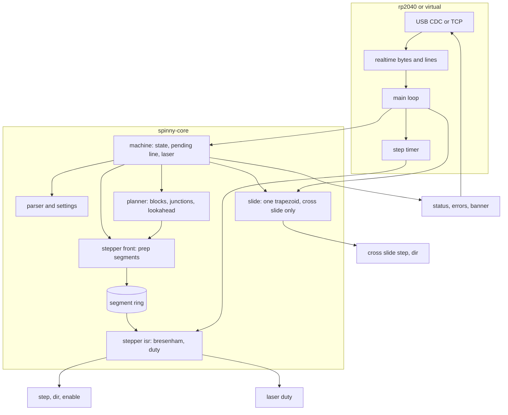

# spinny firmware

The machine's own controller. It moves two joints, the radius `R` in mm
and the table angle `A` in degrees, along straight lines in joint space,
and drives the laser so the power follows the speed actually reached. It
knows nothing about boards: the web backend turns board geometry into
short joint moves and streams them.

A third axis, the cross slide `Z`, carries the rail across the table's
rotation axis. It is a setup axis: it moves on its own, only from `Idle`,
with the beam off, and it is never interpolated with `R` or `A`.

The line protocol is [../docs/PROTOCOL.md](../docs/PROTOCOL.md).

| Crate | What |
| --- | --- |
| `core` | the controller: parser, settings, planner, stepper, cross slide, machine state |
| `rp2040` | the BTT SKR Pico port: USB, step timer, laser PWM, TMC2209, flash |
| `rp2040-logic` | the port's hardware-free arithmetic, so it tests on the host |
| `virtual` | the core on a TCP socket with a virtual clock |

`core`, `rp2040-logic` and `virtual` are one workspace. `rp2040` is
excluded and keeps its own `.cargo/config.toml`, because a `build.target`
there applies to every crate below it and cannot be cancelled from a
child, which would capture the host crates.

## Build and test

```sh
cargo test                                  # core, logic, virtual
cd rp2040 && cargo build --release          # the board
elf2uf2-rs target/thumbv6m-none-eabi/release/spinny-fw spinny-fw.uf2
```

Flashing and the pin table are in [rp2040/README.md](rp2040/README.md).

## Running it without a board

```sh
cargo run --release -p spinny-virtual -- --listen 127.0.0.1:2323 --fast
```

The simulator speaks the same bytes over TCP, so the backend connects to
`socket://127.0.0.1:2323` and behaves as it would with the board. It keeps
its position between clients, as unplugging USB does.

| Option | Effect |
| --- | --- |
| `--listen ADDR` | address to serve, default `127.0.0.1:2323` |
| `--fast` | run time as fast as the host can step it |
| `--trace PATH` | write the beam's marks and the command log as JSON |
| `--settings K=V` | set a machine setting at start, repeatable |
| `--store PATH` | file standing in for the settings sector, so `$save` works |
| `--quiet` | no periodic report on stderr |

The trace holds the board position of every mark the beam would leave,
with its duty as commanded (the pin level is the other way round under
`laser_invert`), plus each line the client sent, when it was accepted and
where the head was then: a motion line is accepted when the planner takes
it, so its `seconds` is the wait for room, not the move. It is written
when a client disconnects and when a run ends.

```sh
picocom -b 115200 /dev/ttyACM0     # or: nc 127.0.0.1 2323
```

## Architecture



The main loop fills the segment ring tens of milliseconds ahead, so a slow
USB packet or a flash write cannot stretch a step. The interrupt only
consumes the ring: it advances the Bresenham counters, pulses the pins and
sets the duty for the segment it starts.

The cross slide is deliberately outside all of that. It runs from the main
loop, capped at 20 kHz, because it only ever moves alone, from rest, with
the beam off, so nothing depends on when its pulses land.
