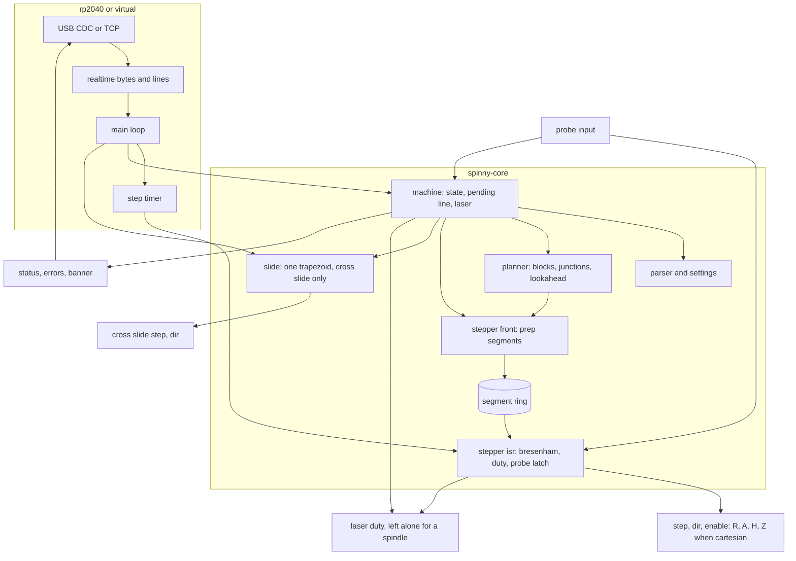

# spinny firmware

The machine's own controller. It moves two joints, the radius `R` in mm
and the table angle `A` in degrees, along straight lines in joint space,
and drives the laser so the power follows the speed actually reached. It
knows nothing about boards: the web backend turns board geometry into
short joint moves and streams them.

An optional third joint, the focus axis `H` in mm, raises and lowers the
head along with the other two, so a cut can follow the board's height,
and carries a touch probe that `probe` lowers onto the board to measure
it. It only takes words with `$h_axis=1`.

The cross slide `Z` carries the rail across the table's rotation axis. It
is a setup axis: it moves on its own, only from `Idle`, with the beam off,
and it is never interpolated with the joints. With `$cartesian=1` it is a
fourth joint instead, stepped with the others, so the rail is X and the
slide Y of an X/Y machine while the table holds its angle.

With `$spindle=1` the laser output drives a spindle, which keeps turning
through moves and holds, and the focus axis is its depth axis.

The line protocol is [../docs/PROTOCOL.md](../docs/PROTOCOL.md).

| Crate | What |
| --- | --- |
| `core` | the controller: parser, settings, planner, stepper, cross slide, machine state |
| `rp2040` | the BTT SKR Pico port: USB, step timer, laser PWM, TMC2209, flash |
| `rp2040-logic` | the port's hardware-free arithmetic, so it tests on the host |
| `virtual` | the core on a TCP socket with a virtual clock |

`core`, `rp2040-logic` and `virtual` are one workspace. `rp2040` is
excluded and keeps its own `.cargo/config.toml`, because a `build.target`
there applies to every crate below it and cannot be cancelled from a
child, which would capture the host crates.

## Build and test

```sh
cargo test                                  # core, logic, virtual
cd rp2040 && cargo build --release          # the board
elf2uf2-rs target/thumbv6m-none-eabi/release/spinny-fw spinny-fw.uf2
```

Flashing and the pin table are in [rp2040/README.md](rp2040/README.md).

## Running it without a board

```sh
cargo run --release -p spinny-virtual -- --listen 127.0.0.1:2323 --fast
```

The simulator speaks the same bytes over TCP, so the backend connects to
`socket://127.0.0.1:2323` and behaves as it would with the board. A client
that hangs up, or only shuts its sending side (`nc -N`), stands for a USB
unplug: the machine stops and keeps its position, and whatever the client
sent that the machine had not taken yet is dropped. A client more than
16 MiB ahead of the machine is dropped the same way.

That is not what the board does when a program only closes its serial
port: it sees an unplug, a bus reset or a suspend, not a port close, so a
queued job, a spindle or a `laser` beam runs on there. A session against
the simulator does not show that closing the port stops anything.

| Option | Effect |
| --- | --- |
| `--listen ADDR` | address to serve, default `127.0.0.1:2323` |
| `--fast` | run time as fast as the host can step it |
| `--trace PATH` | write the beam's marks and the command log as JSON |
| `--machine PATH` | a machine file from `machines/` (`docs/MACHINES.md`): its axes, kinematics and tool applied to the settings at start |
| `--settings K=V` | set a machine setting at start, repeatable; after `--machine` it overrides the file |
| `--store PATH` | file standing in for the settings sector, so `$save` works |
| `--surface B[,SX,SY[,C]]` | a board under the probe, its top at focus height `B + SX*x + SY*y + C*(x^2 + y^2)`; without it a probe finds nothing |
| `--probe-offset L,C` | the probe tip `L` mm along the rail and `C` mm across it from the beam; it adds no board of its own |
| `--quiet` | no periodic report on stderr |

A probe on the simulator needs the focus axis too:
`--machine ../machines/polar-laser-focus.toml --surface -1.5,0.002,-0.001`
gives a tilted board 1.5 mm below the head's zero.

The trace holds the board position and focus height of every mark the
beam would leave, with its duty as commanded (the pin level is the other
way round under `laser_invert`). An output left on in one place, a burn
in place or a spindle turning at rest, is a mark where it starts and one
where it changes. It also holds each line the client sent, with when it
was sent and answered and every joint (`r`, `a`, `h`, `z`) at both: a
motion line is answered when the planner takes it, so its `seconds` is
the wait for room and its `to` is where the head was then, not where the
move ends. It is written when a client disconnects and whenever the
machine comes to rest, a hold included.

```sh
picocom -b 115200 /dev/ttyACM0     # or: nc 127.0.0.1 2323
```

## Architecture



The main loop fills the segment ring tens of milliseconds ahead, so a slow
USB packet or a flash write cannot stretch a step. The interrupt only
consumes the ring: it advances the Bresenham counters, pulses the pins and
sets the duty for the segment it starts.

A probe block is the one exception to filling far ahead: it keeps only
`$probe_ms` of segments queued (20 ms by default), because a brake only
reaches segments not yet written, and the interrupt reads the probe input
at every tick of it, latching the focus position at contact for the main
loop to report once it has braked. With `$probe_ms=0` and a probe slow
enough for the axis to stop at once, the interrupt drops the ring at the
contact instead, and the head stops on that step.

The cross slide is deliberately outside all of that. It runs from the main
loop, capped at 20 kHz, because it only ever moves alone, from rest, with
the beam off, so nothing depends on when its pulses land.

On a cartesian machine (`$cartesian=1`) it is inside all of that: the
planner and the interrupt carry it as the fourth joint, `Slide` stays idle,
and switching the setting hands the position from one to the other so the
slide stays where it was. A cut's board length is then `hypot(dr, dz)`,
and the table holds its angle, since `go` and `cut` refuse `A`; a jog
that turns it sweeps the head's distance from the axis, `hypot(R, Z)`.

A spindle (`$spindle=1`) is the machine's alone: `Shared::spindle` keeps
the interrupt from writing the output, and the machine drives it at the
speed `spindle S` set from the main loop, through motion and holds, until
`spindle off`, a reset, a disconnect or an alarm.
