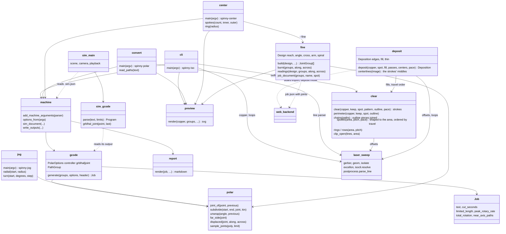

# spinny-laser toolpath

The Python library behind the web backend and the command line tools:
polar kinematics (`polar`), copper clearing (`clear`) and deposition
(`deposit`), the centering coupons (`center`, `fine`), the machine
configuration files (`machines`), and the gcode emitter for a grblHAL
controller (`gcode`, `machine`, `report`, `preview`).

| Command | Job |
| --- | --- |
| `spinny-iso` | KiCad board or gerber to isolation gcode placed on the axis |
| `spinny-polar` | re-place and pre-split an existing X/Y laser job |
| `spinny-jog` | MDI rapids for setup: move radially or turn the table |
| `spinny-center` | a burn that shows where the rotation axis really is; `--fine` amplifies what is left |
| `spinny-sim` | play a job back on a model of the machine |

Usage, the grblHAL setup and what the files contain are in
[docs/GCODE.md](../docs/GCODE.md); reading the coupons is in
[docs/CALIBRATION.md](../docs/CALIBRATION.md). The outputs go to
`var/out/` unless `-o` says otherwise.

```sh
uv run pytest toolpath/tests
```

## Architecture


