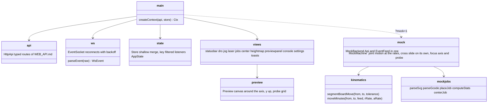

# spinny-web frontend

Browser interface for the rotary table laser, built with Bun and plain
TypeScript: no framework, one store, views that draw from it.

```sh
cd web/frontend
bun install
bun run check && bun test && bun run build
bun run dev            # serves index.html with the sources
```

`bun run build` writes `dist/`, which the backend serves at `/`. Open
`?mock=1` for an in-page machine that needs no backend; `?api=http://host:8000`
points the page at a backend elsewhere, which must have been started with
that page's origin allowed: `spinny-web --cors-origin http://localhost:3000`
for the dev server. Without it the browser refuses every call.

Board coordinates are mm with the rotation axis at the origin: `x = r cos a`,
`y = r sin a`, y up in the preview. The DRO shows the joint (`R` mm, `A` deg),
the cross slide (`Z` mm), the focus axis (`H` mm) and the probe on a machine
with one, and the board position the backend derives from the joint. The
cross slide is a setup axis: the jog panel moves it on its own, in the small
steps a centering burn is measured into.

The Height map panel probes a grid (drawn on the preview before and while it
is probed), shows the heights as a map of the board seen from above, blue
below the mean and red above it, and sets the focus offset. The run button
sends the chosen compensation, which turns to `auto` once a map is usable.

## Architecture


