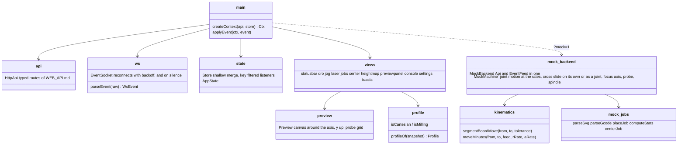

# spinny-web frontend

Browser interface for the rotary table laser, built with Bun and plain
TypeScript: no framework, one store, views that draw from it.

```sh
cd web/frontend
bun install
bun run check && bun test && bun run build
bun run dev            # serves index.html with the sources
```

`bun run build` writes `dist/`, which the backend serves at `/`. Open
`?mock=1` for an in-page machine that needs no backend (`src/mock/`);
`?api=http://host:8000`
points the page at a backend elsewhere, which must have been started with
that page's origin allowed: `spinny-web --cors-origin http://localhost:3000`
for the dev server. Without it the browser refuses every call.

Board coordinates are mm with the rotation axis at the origin: `x = r cos a`,
`y = r sin a`, y up in the preview. The DRO shows the joint (`R` mm, `A` deg),
the cross slide (`Z` mm), the focus axis (`H` mm) and the probe on a machine
with one, and the board position the backend derives from the joint. The
cross slide is a setup axis: the jog panel moves it on its own, in the small
steps a centering burn is measured into.

The page follows what the machine is (`profile` in the backend's state,
from `$cartesian` and `$spindle`), with a badge in the status bar when it
is not the polar laser. On a cartesian machine the cross slide is the Y
axis: it steps like the rail, at the feed given, and the joint goto takes
`r` and `z`. With a spindle the laser panel starts and stops the spindle,
the groups table has depth and plunge in place of the power floor, the
focus axis is the depth axis, "Focus here" is "Touch off here", and the
settings panel has the travel clearance and spin-up. The in-page mock
takes those settings too: with `$cartesian=1` the cross slide is a joint
and a board move is one line in the table's frame, and with `$spindle=1`
it mills a job the way the backend streams one (lift, spindle start,
spin-up dwell, plunge, cuts at depth, lift, spindle off). The preview draws
a cartesian machine's soft limits as a box turned with the table.

The Height map panel probes a grid (drawn on the preview before and while it
is probed), shows the heights as a map of the board seen from above, blue
below the mean and red above it, and sets the focus offset. The run button
sends the chosen compensation, which turns to `auto` while a map is usable
and back to off when it is not. The backend drops the focus offset whenever
the focus axis may have moved to other numbers (Set H=0, a connect, the
firmware restarting, a loaded map); the page then asks for Focus here (Touch
off here) again before a run follows the map. Probing is locked while the
spindle turns, and the spindle start while probing. The status reports the
output's duty as driven on the pin; the DRO and the probe lock turn it
around on an active-low output (`laser_invert`), as the backend does.

Arrow keys jog when no field that uses them has focus; Escape cancels a jog
or goto from anywhere but a dialog while a machine is connected. The event feed is opened again when it
goes silent for 5 s while a machine is connected, since a backend host that
loses power sends no close. The page reads the settings again when the
machine, or the profile in its state frames, changes, and after a setting
typed at the console.

## Architecture


